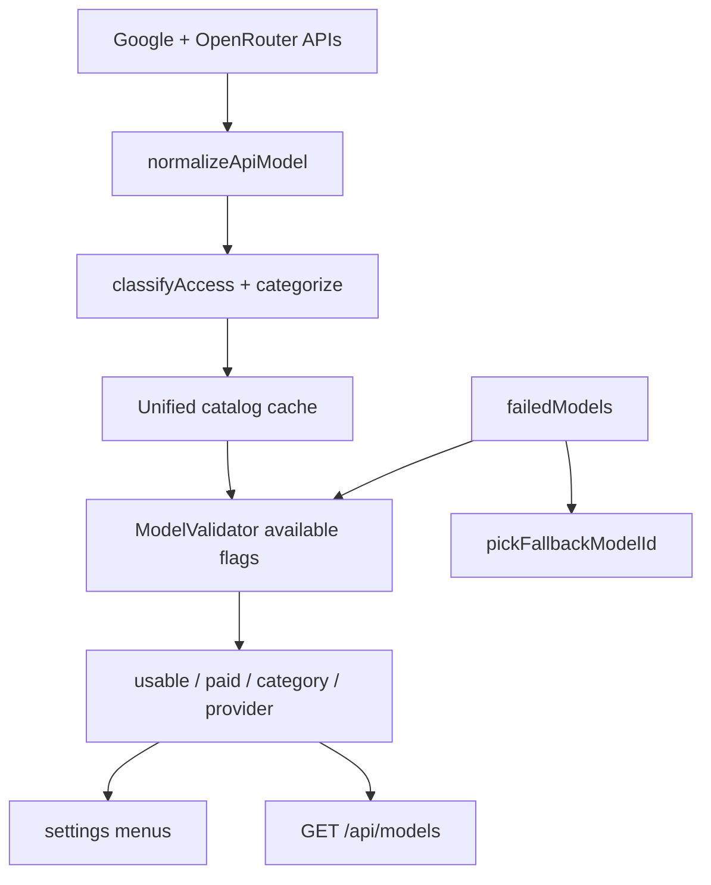

# Model & Chat Data Flow

**Rules**

- Currently Usable / Category / Provider = no payment required + key + not failed
- Paid Catalog = payment required only (reference; selectable if keyed)
- Google AI Studio models with free API keys are **usable**, not paid
