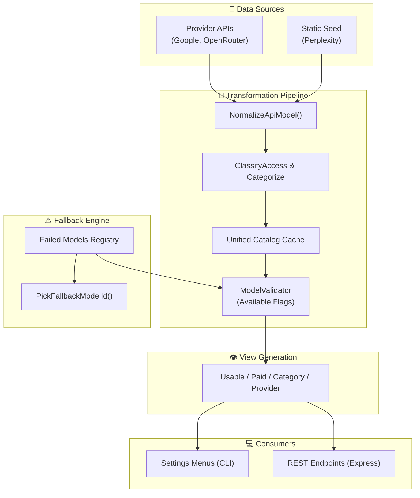

# Execution & Data Flow

This document maps the exact lifecycle of a user prompt, from input parsing to tool execution and output generation.

## Full Request Lifecycle

```mermaid
sequenceDiagram
  autonumber
  participant User as 🧑‍💻 User / Client
  participant Agent as 🤖 Agent Core
  participant Context as 📚 ContextAssembler
  participant LLM as 🧠 LLM API
  participant Orch as ⚙️ Orchestrator
  participant Tool as 🔨 ToolRuntime

  User->>Agent: Prompt (e.g. "Fix the logger")
  
  %% Context Phase
  rect rgb(40, 44, 52)
    Note over Agent, Context: Phase 1: Context Indexing
    Agent->>Context: Request Context Assembly
    Context-->>Agent: Injects AST signatures & Vector Matches
  end

  %% LLM Inference Phase
  rect rgb(45, 30, 45)
    Note over Agent, LLM: Phase 2: LLM Inference
    Agent->>LLM: Send structured prompt (with Context)
    LLM-->>Agent: Response (includes Tool Calls)
  end

  %% Orchestration Phase
  rect rgb(30, 40, 45)
    Note over Agent, Tool: Phase 3: Orchestration & Execution
    Agent->>Orch: Intercept Tool Calls
    Orch->>Orch: Evaluate Policy & Budget Limits
    alt Policy Denied / Budget Exhausted
      Orch-->>Agent: Halt Execution
    else Policy Approved
      Orch->>Tool: Execute Tool (File / Git / Command)
      Tool-->>Orch: Tool Result (Success/Fail)
      Orch-->>Agent: Return Result to LLM Loop
    end
  end
  
  Agent-->>User: Output Markdown to UI
```

---

## Model Sanitize & Categorization Data Flow

**Catalog Rules**:
- **Currently Usable** / **Category** / **Provider** = Free API/no payment required + key is set + not flagged as failed.
- **Paid Catalog** = Payment required models only (acts as a reference; selectable if keyed).
- Google AI Studio models with free API keys are treated as **usable**, not paid.
