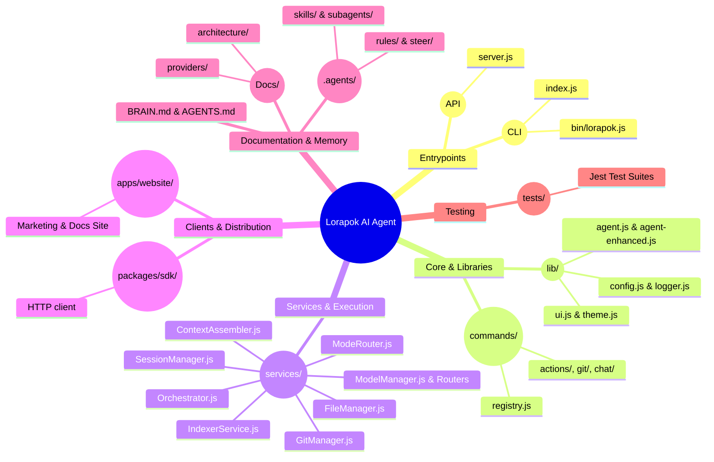

> [!IMPORTANT]
> **Post-Prompt Trigger (MANDATORY)**: If you modify the codebase in a way that affects this document, you must automatically execute the Sync Protocol and update this file before completing your response.

# Module Map

# Module Map & Directory Structure

