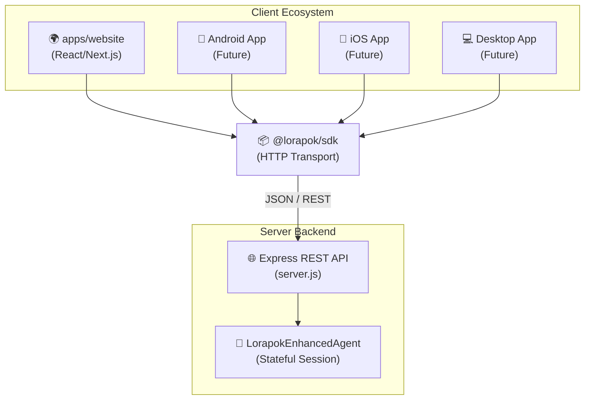

> [!IMPORTANT]
> **Post-Prompt Trigger (MANDATORY)**: If you modify the codebase in a way that affects this document, you must automatically execute the Sync Protocol and update this file before completing your response.

# Multi-Client Architecture

## Principle

All non-CLI clients talk to the **Express REST API** through **`@lorapok/sdk`**. Never duplicate model sanitization in clients — always use `GET /api/models?view=usable|paid|all`.

## Clients

| Client | Location | Status |
|--------|----------|--------|
| CLI | repo root | Ready |
| Website | `apps/website/` | Ready |
| JS/TS SDK | `packages/sdk/` | Ready (stub) |
| Android / iOS | future `apps/android`, `apps/ios` | Planned |
| Desktop | future | Planned |

## Versioning

- Agent npm package: root `package.json` (`lorapok-ai`)
- SDK: `@lorapok/sdk` private until published
- API contract docs: [Docs/api/REST.md](../api/REST.md)
