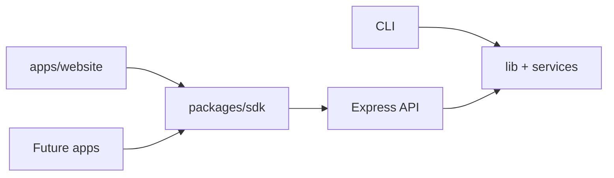

# 🏗️ System Architecture Overview

Lorapok is an **action-oriented AI coding agent** with:

1. **CLI** (`index.js`, `bin/lorapok.js`) — interactive slash commands and `@` file mentions
2. **Express API** (`server.js`) — REST for web and future mobile clients
3. **Core services** — `Orchestrator`, `SessionManager`, `ModeRouter`, `Adapters`, `ModelManager`, Git/File/Actions
4. **Clients** — `apps/website` today; Android/iOS/desktop via `packages/sdk`

See also [MULTI_CLIENT.md](MULTI_CLIENT.md), [DATA_FLOW.md](DATA_FLOW.md), [MODULE_MAP.md](MODULE_MAP.md).
